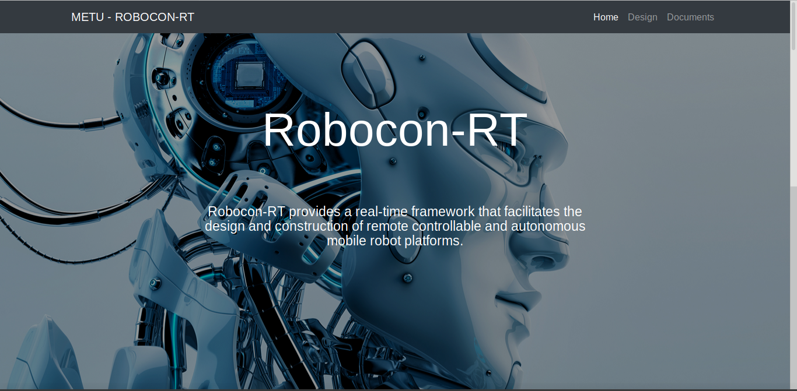

# [Robocon-RT](http://user.ceng.metu.edu.tr/~e2099018/Robocon-RT_Website/)

Beware that website may not be reached from the above link, because the code lives on my university account.

## Preview

## Status

## Download and Installation

To begin using this template, choose one of the following options to get started:
* [Download the latest release on Start Bootstrap](https://startbootstrap.com/template-overviews/business-frontpage/)
* Install via npm: `npm i startbootstrap-business-frontpage`
* Clone the repo: `git clone git@github.com:axydor/Robocon-RT_Website.git`
* [Fork, Clone, or Download on GitHub](https://github.com/axydor/Robocon-RT_Website)

## Usage

### Basic Usage

After downloading, simply edit the HTML and CSS files included with the template in your favorite text editor to make changes. These are the only files you need to worry about, you can ignore everything else! To preview the changes you make to the code, you can open the `index.html` file in your web browser.

## Bugs and Issues

We do NOT maintain or look at this project forever. Therefore, please do think twice before asking us a question related to the project. Just joking, always you can ask questions :). By the way, I have to admit that making the website was more joyful than the real project ;)

## Copyright and License

Copyright 2013-2019 Blackrock Digital LLC. Code released under the [MIT](https://github.com/BlackrockDigital/startbootstrap-business-frontpage/blob/gh-pages/LICENSE) license. We have fethed some images from the web without asking the user permission in order to meet our project deadline, I hope they do not open law-suit against me/us. 

